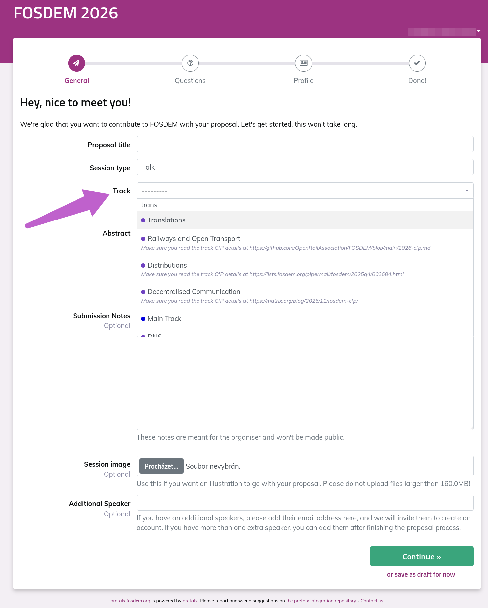

**[Schedule]([https://fosdem.org/2026/](https://fosdem.org/2026/schedule/track/translations/)**

**This devroom aims to showcase successful approaches in libre localization, community achievements, innovative workflows, tools, and integrations.**

**Come and share your experience with the localization process. Inspire others or propose solutions to struggles you spotted. It can be related to FOSS, open hardware, manuals, etc. 
Talk about what you find important; it can be your approach on used tools, community dynamic, workflows, benefits. Inspire others, leave inspired and carry new knowledge.**

## What

Talks describing collaborative efforts are the most welcome. Having a stack of good, well-integrated tools is just one part of the process. Don’t stop there. 
*   How do you motivate and care about your project’s community?
*   What did you learn when you introduced changes, improvements, and pursued milestones?
*   What inspired you to translate and improve the localization process and outcome for all developers, users, and translators?

## Where

**Room k3401** of [FOSDEM 2026](https://fosdem.org/2026/) (see the map in Location at the bottom) at [ULB Solbosch Campus, Brussels, Belgium](https://fosdem.org/2026/practical/transportation/). It's the modern building with the main infodesk. Consider a libre [mobile app](https://fosdem.org/2026/schedule/mobile/) with a map and schedule in it.

## When

*   **CfP** submission **deadline: 5th December 2025**, 23:55 CET
*   Schedule is in the process, only some speakers confirmations remain
*   We meet in the devroom: **Sunday, 1st February 2026; 13:15-17:00 CET**.

## Welcomed topics: 

*   Your own localization-related ideas
*   Users' happines and experience improvement delivered by quality translations
*   Introducing and implementing changes into large communities
*   Tools used, integrated and improved
*   Success brought to the project by improved translations
*   Keeping community enthused, active, informed, organized

These are just suggestions and we encourage you to be creative with your proposals. Make the talk yours! :)

A few Notes:

*   You must attend in person to present your talk at FOSDEM.
*   You need to follow [FOSDEM's Code Of Conduct](https://fosdem.org/2026/practical/conduct/)
*   Speaking slots are 25 minutes in length (including Q&A) with 5 minutes between the sessions. Should you be able to squash your talk into a shorter duration, mention that in your proposal; we might squeeze in more knowledge into the devroom thanks to you!
*   FOSDEM is a [FLOSS](https://en.wikipedia.org/wiki/Free_and_open-source_software) community event, so please ensure your topic is appropriate (i.e., sales pitches will be rejected).
*   No compensation can be offered for your talk.

## CfP Selection group 

| members | projects and communities, current and former |
| --------------------------------------------- | ------------ |
| Benjamin Alan Jamie | Weblate, Turris | 
| Jean-Baptiste Holcroft | Fedora, OpenStreetMap |
| Kartik Ohri | Metabrainz, Weblate, VideoLAN |
| Karen Kleinbauerů | Weblate, Moodle |
| Michal Čihař | Weblate, Debian, SUSE |
| Alice Víšek | Weblate |

## How to Submit

Go to the FOSDEM 2026 Pretalx website, pick out a fitting name, select the **session type** *Talk*, and select *Translations* in the **Track** dropdown menu.

**[I won't postpone it, I'll do it now!](https://pretalx.fosdem.org/fosdem-2026/cfp)**
--

## Contacts

*   [Benjamin](https://mastodon.social/@orangesunny) - Weblate Community manager, devroom-responsible person; happy to asnwer your questions and assist

  
## More information
*   There will be more translations-related events at FOSDEM! Check the schedule once it's published.

*   [More information about the FOSDEM mailing list](https://lists.fosdem.org/listinfo/fosdem)

*   This website is a fork of Database devroom website. We appreciate them! You might want to [visit them](https://fosdem-cloud-native-databases-devroom.github.io/) and send a proposal there as well. Or tell your DB friends.

*   [Website repository on GitHub](https://github.com/Translations-devroom/FOSDEMtranslationsDevroom26)
